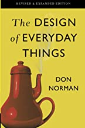

<!-- README.md is generated from README.Rmd. Please edit that file -->

```{r, include = FALSE}
knitr::opts_chunk$set(
  collapse = TRUE,
  comment = "#>"
)
```

# everyday ggplot2 extension

<!-- badges: start -->
<!-- badges: end -->


Everyday ggplot2 is a collection of resources for people that want to get into ggplot2 extension but might not be confident of how to do so ('absolute newcomers').

Everyday is meant in the sense of *ordinary* -- you don't need to create a flashy ggplot2 extension for it to 'count'. You don't need to have lots of people using the extension. You don't need the extension to be on CRAN or write a package for the extension. You don't even need a hex sticker! It is nice if the extension does some work for you or just makes you happy. 

It's also meant in the sense of *frequent* -- practicing ggplot2 extension will probably make you better at extension - you'll be in a position to write that next handy extension once when you have more under your belt.

Yes, 'The Design of Everyday Things' also comes to mind for us. We do want to thoughtfully design new avenues for bringing people into ggplot2 extension.  

And we also recognize that we might make 'Norman' (poorly designed) ggplot2 extension along the way.  

```{r}

```

Mistakes are instructive and memorable; it's hard to imagine Norman's book selling as well without the ill-conceived tea kettle gracing the cover. Expecting mistakes is another reason to make ggplot2 extension a less out-of-the-ordinary experience; past extensions feel less precious and we can part ways with them if appropriate. 

```{r}
library(ggstamp)
library(ggplot2)
ggcanvas() + 
  stamp_polygon(x0y0 = pos_honeycomb(n = 9), 
                fill = "darkgoldenrod1") + 
  stamp_text(label = c("ggxmean", "ggstamp", "ggols", 
                       "ggsample", "ggcalendar", 
                       "ggchalkb...", "ggquiet", "ggcirclepack",
                       "ggdirect"), 
             xy = pos_honeycomb(n = 9), size = 5) +
  labs(title = "trying stuff out in ggplot2 extension",
       subtitle = "honeycombs are surprisingly strong structures",
       caption = "expert and experiment have the same latin root: 'experi', to try") 

```

# 

What is [ggplot2](https://github.com/tidyverse/ggplot2) ?


# 3 waves of extenders?

- stalwarts; long-time ggplot2 extenders and developers
- warming up; [https://github.com/teunbrand/ggplot-extension-club]
- absolute newcomers; ggplot2 super-users, no extension experience [tutorial evaluation is underway and focus group may seed absolute newcomers group]

# New resources for absolute beginners 

 - compute_group recipes and tutorial
 - compute_panel recipes and tutorial
  
  # ggextend: browseable, minimal working examples

# Opportunities for extension?

The reason ggplot2 exists is explained by Hadley Wickham in an interview:

> And, you know, I'd get a dataset. And, *in my head I could very clearly kind of picture*, I want to put this on the x-axis. Let's put this on the y-axis, draw a line, put some points here, break it up by this variable.  And then, like, getting that vision out of my head, and into reality, it's just really, really hard. Just, like, felt harder than it should be. Like, there's a lot of custom programming involved, where I just felt, like, to me, I just wanted to say, like, you know, *this is what I'm thinking, this is how I'm picturing this plot. Like you're the computer 'Go and do it'.*  ... and I'd also been reading about the Grammar of Graphics by Leland Wilkinson, I got to meet him a couple of times and ... I was, like, this book has been, like, written for me.
 - https://www.trifacta.com/podcast/tidy-data-with-hadley-wickham/

To paraphrase, fact that ggplot2 is built on the grammar of graphics, with its logically decomposed bits, lets you fly through plot creation with the greatest of ease.  You can go from the plot you've already pictured in your head into reality by describing it.

After a good amount of time using ggplot2, you get used to this flying sensation.  You've practiced and mastered the grammar.  You are a composer of graphical poems. You confidently speak plots into existence. Poetry slam!

Until you find yourself with a loss for graphical words within ggplot2. At some point ggplot2 will *seem* to fail to give you the fluid ggplot2 experience.  One day you will find yourself saying, 'Why aren't I flying?"  This might be a moment to check your grammar prowess; or it might be a moment to turn to ggplot2 extension(s)!

```{r, fig.cap="The 'daring young man on the flying trapeze', Jules Leotard."}
knitr::include_graphics("jules_leotard.jpeg", )
```

Heuristics for recognizing ggplot2 extension opportunities:

- I don't feel like I'm flying; but usually I do
- My brain hurts because of the plot I'm trying to build; but usually it's happy or 
- 'getting that vision out of my head, and into reality, it’s just really, really hard... harder than it should be.'

```{r}
library(gganatogram)
gganatogram(data=hgFemale_key, outline = T, 
            fillOutline='#a6bddb', 
            organism='human', sex='female', fill="colour")  +
  ggstamp::stamp_wash(alpha = .8) +
  geom_polygon(data = hgFemale_list$brain, aes(x = x, y = -y), 
            fill = "red") +
  coord_equal() + 
  stamp_text_ljust(label = "Ouch!", angle = 5)

# brainstorming a stamp (annotation) layer for the brain...
stamp_female_brain <- function(...){
  
    geom_polygon(data = hgFemale_list$brain, aes(x = x, y = -y),...)
  # could be polygon
  
}

```


<!-- > Pooh began to feel a little more comfortable, because when you are a Bear of Very Little Brain, and you Think of Things, you find sometimes that a Thing which seemed very Thingish inside you is quite different when it gets out into the open and has other people looking at it. - A.A. Milne The House at Pooh Corner (1928) ch. 6 -->


# Existing resources

### Extending ggplot2

* [Extending your ability to extend ggplot2](https://www.rstudio.com/resources/rstudioconf-2020/extending-your-ability-to-extend-ggplot2/) by Thomas Lin Pederson at rstudio::conf 2020
* The [extending ggplot2](https://ggplot2.tidyverse.org/articles/extending-ggplot2.html) vignette
* The extending ggplot2 chapters of the [ggplot2 book](https://ggplot2-book.org/):
  * Chapter 19: [Programming with ggplot2](https://ggplot2-book.org/programming.html)
  * Chapter 20: [ggplot2 internals](https://ggplot2-book.org/internals.html)
  * Chapter 21: [Writing ggplot2 extensions](https://ggplot2-book.org/extensions.html)
  * Chapter 22: [Case Study: Springs](https://ggplot2-book.org/spring1.html)
* The [ggproto](https://stackoverflow.com/questions/tagged/ggproto) tag on StackOverflow
* [Cracking open ggplot internals with {ggtrace}](https://www.rstudio.com/resources/rstudioconf-2020/best-practices-for-programming-with-ggplot2/) by June Choe at rstudio::conf 2022
* [Best practises for programming with ggplot2](https://www.rstudio.com/resources/rstudioconf-2020/best-practices-for-programming-with-ggplot2/) by Dewey Dunnington at rstudio::conf 2020


### Extensions

* The [extensions gallery](https://exts.ggplot2.tidyverse.org/gallery/)
* The [Awesome `ggplot2`](https://github.com/erikgahner/awesome-ggplot2) repository


