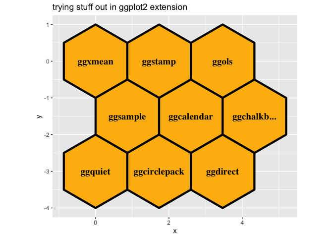

<!-- README.md is generated from README.Rmd. Please edit that file -->

# everyday ggplot2 extension

<!-- badges: start -->

<!-- badges: end -->

Everyday ggplot2 is a collection of resources for people that want to
get into ggplot2 extension but might not be confident of how to do so.

Everyday is meant in the sense of *ordinary* – you don’t need to create
a flashy ggplot2 extension for it to ‘count’. You don’t need to have
lots of people using the extension. You don’t need the extension to be
on CRAN. You don’t need to write a package for the extension. You don’t
even need a hex sticker\! It is nice if the extension does some work for
you.

It’s also meant in the sense of *frequent* – practicing ggplot2
extension will probably make you better at extension - you’ll be in a
position to write that next handy extension once when you have more
under your belt.

Yes, we are referencing ‘the design of everyday things’. We do want to
thoughtfully design new avenues for bringing people into ggplot2
extension.

And we also recognize that we might make ‘Norman’ (poorly designed)
ggplot2 extension along the way; and that’s okay and part of the
process. This is another reason to make ggplot2 extension a less
‘extraordinary’ experience; past extensions feel less precious and we
can part ways with them if need be.

``` r
library(ggstamp)
library(ggplot2)
ggcanvas() + 
  stamp_polygon(x0y0 = pos_honeycomb(n = 9), 
                fill = "darkgoldenrod1") + 
  stamp_text(label = c("ggxmean", "ggstamp", "ggols", 
                       "ggsample", "ggcalendar", 
                       "ggchalkb...", "ggquiet", "ggcirclepack",
                       "ggdirect"), 
             xy = pos_honeycomb(n = 9), size = 5) +
  labs(title = "trying stuff out in ggplot2 extension")
```

<!-- -->

# Communities: 3 waves of extenders

  - stalwarts
  - warming up
  - absolute newcomers

Interaction between groups…

# Recipes: unpackaged, minimal working examples

# ggextend

# 

Existing resources

  - 
  - 
  - 
  -
