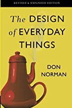
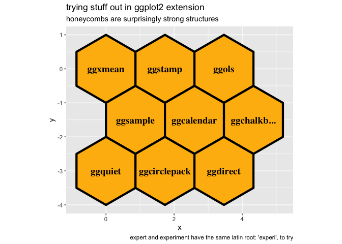
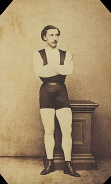
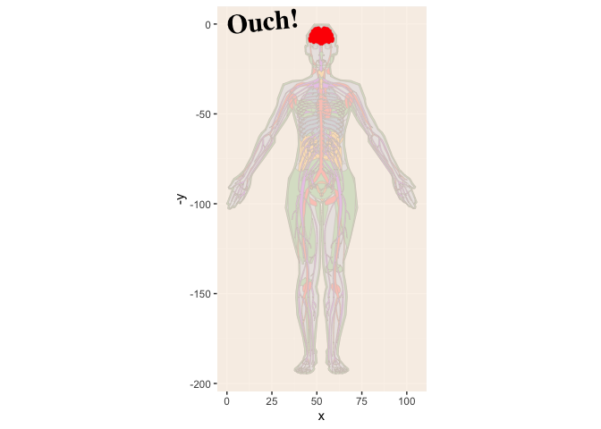

<!-- README.md is generated from README.Rmd. Please edit that file -->

# everyday ggplot2 extension

<!-- badges: start -->

<!-- badges: end -->

‘everyday ggplot2 extension’ is a resource for people that want to get
into ggplot2 extension but might not be confident of how to do so
(‘absolute newcomers’). It introduces some new points of entry
including in education materials (recipes) and
networking/troubleshooting/celebrating/collaborating spaces.

‘Everyday’ is meant in the sense of *ordinary* – you don’t need to
create a flashy ggplot2 extension for it to ‘count’. You don’t need to
have lots of people using the extension. You don’t need the extension to
be on CRAN or write a package for the extension. You don’t even need a
hex sticker\! It is nice if the extension does some work just for you or
simply makes you happy. Package development know-how can be
complementary to ggplot2 extension, but are NOT a prerequisite. Lack of
package building knowledge shouldn’t hold back the extension curious\!

‘Everyday’ is also meant in the sense of *frequent* – practicing ggplot2
extension will probably make you better at extension - you’ll be in a
position to write that next handy extension once when you have more
experience under your belt.

And, yes our title evokes, ‘The Design of Everyday Things’. We do want
to thoughtfully design new avenues for bringing people into ggplot2
extension.

And we also recognize that we will make ‘Norman’ (poorly designed)
ggplot2 extension along the way. And this is fine since mistakes can
sometimes be more instructive and memorable than doing things ‘the right
way’ the first time round.

``` r

```


It’s hard to imagine Norman’s book selling as well without the
ill-conceived tea kettle gracing the cover. Expecting mistakes is
another reason to make ggplot2 extension a less out-of-the-ordinary
experience; past extensions feel less precious and we can part ways with
them if appropriate. Curious to know if folks agree\!

``` r
library(ggstamp)
library(ggplot2)
ggcanvas() + 
  stamp_polygon(x0y0 = pos_honeycomb(n = 9), 
                fill = "darkgoldenrod1") + 
  stamp_text(label = c("ggxmean", "ggstamp", "ggols", 
                       "ggsample", "ggcalendar", 
                       "ggchalkb...", "ggquiet", "ggcirclepack",
                       "ggdirect"), 
             xy = pos_honeycomb(n = 9), size = 5) +
  labs(title = "trying stuff out in ggplot2 extension",
       subtitle = "honeycombs are surprisingly strong structures",
       caption = "expert and experiment have the same latin root: 'experi', to try") 
```

<!-- -->

# How do I know there’s an opportunity for extension?

The reason ggplot2 exists is explained by Hadley Wickham in an
interview:

> And, you know, I’d get a dataset. And, *in my head I could very
> clearly kind of picture*, I want to put this on the x-axis. Let’s put
> this on the y-axis, draw a line, put some points here, break it up by
> this variable. And then, like, getting that vision out of my head, and
> into reality, it’s just really, really hard. Just, like, felt harder
> than it should be. Like, there’s a lot of custom programming involved,
> where I just felt, like, to me, I just wanted to say, like, you know,
> *this is what I’m thinking, this is how I’m picturing this plot. Like
> you’re the computer ‘Go and do it’.* … and I’d also been reading about
> the Grammar of Graphics by Leland Wilkinson, I got to meet him a
> couple of times and … I was, like, this book has been, like, written
> for me. -
> <https://www.trifacta.com/podcast/tidy-data-with-hadley-wickham/>

To paraphrase, fact that ggplot2 is built on the grammar of graphics,
with its ‘logically decomposed bits’, should let you fly through plot
creation with ease. You can go from the plot you’ve already pictured in
your head into reality by describing it.

After a good amount of time using ggplot2, you get used to this flying
sensation. You’ve practiced and mastered the grammar. You are a composer
of graphical poems. You confidently speak plots into existence. Poetry
slam\!

But then one day you may find yourself with a loss for graphical words
within ggplot2. At some point ggplot2 will *seem* to fail to give you
the fluid ggplot2 experience. One day you will find yourself saying,
’Why aren’t I flying?" This might be a moment to double-check your
grammar prowess; or it might be a moment to turn to ggplot2
extension(s)\!

If, after browsing existing extensions, the [extensions
gallery](https://exts.ggplot2.tidyverse.org/gallery/) and the [Awesome
`ggplot2`](https://github.com/erikgahner/awesome-ggplot2) repository,
you can’t find what you need to fly again, you can consider creating
your own extension.

``` r
knitr::include_graphics("jules_leotard.jpeg", )
```

<div class="figure">



<p class="caption">

The ‘daring young man on the flying trapeze’, Jules Leotard.

</p>

</div>

To summarize, here are some situations that indicate there might be a
ggplot2 extension opportunity:

  - I don’t feel like I’m flying; but usually I do
  - My brain hurts because of the plot I’m trying to build; but usually
    it’s happy or
  - ‘getting that vision out of my head, and into reality, it’s just
    really, really hard… harder than it should be.’

<!-- end list -->

``` r
library(gganatogram)
#> Loading required package: ggpolypath
gganatogram(data=hgFemale_key, outline = T, 
            fillOutline='#a6bddb', 
            organism='human', sex='female', fill="colour")  +
  ggstamp::stamp_wash(alpha = .8) +
  geom_polygon(data = hgFemale_list$brain, aes(x = x, y = -y), 
            fill = "red") +
  coord_equal() + 
  stamp_text_ljust(label = "Ouch!", angle = 5)
#> Warning in annotate(geom = "rect", xmin = xmin, ymin = ymin, xmax = xmax, :
#> Ignoring unknown aesthetics: x and y
```

<!-- -->

``` r

# brainstorming a stamp (annotation) layer for the brain...
stamp_female_brain <- function(...){
  
    geom_polygon(data = hgFemale_list$brain, aes(x = x, y = -y),...)
  # could be polygon
  
}
```

<!-- > Pooh began to feel a little more comfortable, because when you are a Bear of Very Little Brain, and you Think of Things, you find sometimes that a Thing which seemed very Thingish inside you is quite different when it gets out into the open and has other people looking at it. - A.A. Milne The House at Pooh Corner (1928) ch. 6 -->

# A new ‘easy recipes’ approach: Taste, succeed, minimally modify

layer extension recipes take the form:

  - Step 0. Get the job done with ‘base’ ggplot2. It’s a good idea to
    clarify what needs to happen without getting into the extension
    architecture
  - Step 1. Write a computation function. Wrap the necessary computation
    into a function.
  - Step 2. Define a ggproto object. ggproto objects allow your
    extension to work together with base ggplot2 functions\! You’ll use
    the computation function from step 1 to help define it.
  - Step 3. Write your geom/stat\_\* function\! You’re ready to write
    your function. You will incorporate the ggproto from step 2.
  - Step 4. Test/Enjoy\! Take your new geom for a spin\! Check out
    group-wise computation behavior\!

## compute\_group recipes and tutorial

  - 
  - 
  - compute\_panel recipes and tutorial

  - ggextend: browseable, minimal working examples

# Communities of practice

Communities of practice can help motivate and sustain productivity of
projects. While

  - stalwarts; long-time ggplot2 extenders and developers

‘everyday ggplot2 extension’ would like to point you to new communities
of practice – places were you can share work and frustrations in the
ggplot2 world:

  - warming up; \[<https://github.com/teunbrand/ggplot-extension-club>\]

I’m hopeful that an ‘absolute newcomers’ group may develop; this could
consist of ggplot2 super-users, no extension experience [tutorial
evaluation is underway and focus group may seed absolute newcomers
group](https://github.com/EvaMaeRey/easy-geom-recipes) and their
collaborators (is it cool and fun to explore the ggplot2 extension space
w/ absolute newcomers *to ggplot2 and R* - yes it is\!). It might spin
off of the focus groups for the ‘easy geom recipes’ evaluation.

‘everyday ggplot2 extension’ promotes the ‘warming up’ group and aspires
to serve an ‘absolute newcomers’ group; and to promote cross pollination
between groups.

  - [ggpuzzles](https://github.com/EvaMaeRey/ggpuzzles) is a place to
    demo minimal not-yet-working examples. Extenders can share their
    good ideas which maybe they don’t have quite the skills or knowledge
    to execute on; or maybe they are just missing a comma\! The
    [ggproto](https://stackoverflow.com/questions/tagged/ggproto) tag on
    StackOverflow is similar but might be dominated by more advanced
    users.

## Subject areas of application

  - stats101verse
    
      - \[ggxmean\]
      - \[ggols\]
      - \[ggsample\]
      - \[ma206data\]
      - \[ma206distributions\]
      - \[ma206equations\]

<!-- https://www.newyorker.com/books/page-turner/the-allure-of-the-map#:~:text=Stevenson%20writes%2C%20in%20an%20essay,predestined%2C%20I%20ticketed%20my%20performance%20'-->

I am told there are people that don’t care for maps, and I find it hard
to believe. Robert Louis Stevenson

  - \[ggamericas\] is an experiment in the geomSf-inheritance space,
    seeking to foster cross-package synergies, lessons learned, and
    emergance of best practices. The following packages are in the works
    and are proposed as early guides in this space:
    
      - [ggfips](https://github.com/EvaMaeRey/ggfips)
      - [ggnorthcarolina]()
      - [ggbrazil](https://github.com/EvaMaeRey/ggbrazil)

  - \[ggatlases\], explorations of non geographic atlases
    
      - ggbrain.experiment
      - gganatomy.experiment
      - ggteeth.experiment

  - counting things
    
      - tidypivot
      - ggcirclepack

Shiny linkage…

  - \[codequoteforshiny\] When you just want to talk about and
    manipulate the contents of a plot and not dig into the weeds of how
    to get there, shiny apps are great\! But if you are writing tools to
    make ggplot2 interfaces that make the code a closer match with how
    we think about the plot “getting the picture out of our heads”, than
    you’ll probably also want to quote the code\! Looking at the code
    shouldn’t feel too “in the weeds” because of the grammar of
    graphic’s conceptual mapping – and your attention to conceptual
    mapping\!

# Beyond ‘everyday ggplot2 extension’

Any ‘everyday’ ggplot2 extender should also be aware of other invaluable
learning resources (compiled by Teun Van Der Brand):

  - The [extending
    ggplot2](https://ggplot2.tidyverse.org/articles/extending-ggplot2.html)
    vignette

  - The extending ggplot2 chapters of the [ggplot2
    book](https://ggplot2-book.org/):
    
      - Chapter 19: [Programming with
        ggplot2](https://ggplot2-book.org/programming.html)
      - Chapter 20: [ggplot2
        internals](https://ggplot2-book.org/internals.html)
      - Chapter 21: [Writing ggplot2
        extensions](https://ggplot2-book.org/extensions.html)
      - Chapter 22: [Case Study:
        Springs](https://ggplot2-book.org/spring1.html)

  - The [ggproto](https://stackoverflow.com/questions/tagged/ggproto)
    tag on StackOverflow

  - [Extending your ability to extend
    ggplot2](https://www.rstudio.com/resources/rstudioconf-2020/extending-your-ability-to-extend-ggplot2/)
    by Thomas Lin Pederson at rstudio::conf 2020

  - [Cracking open ggplot internals with
    {ggtrace}](https://www.rstudio.com/resources/rstudioconf-2020/best-practices-for-programming-with-ggplot2/)
    by June Choe at rstudio::conf 2022

  - [Best practises for programming with
    ggplot2](https://www.rstudio.com/resources/rstudioconf-2020/best-practices-for-programming-with-ggplot2/)
    by Dewey Dunnington at rstudio::conf 2020
